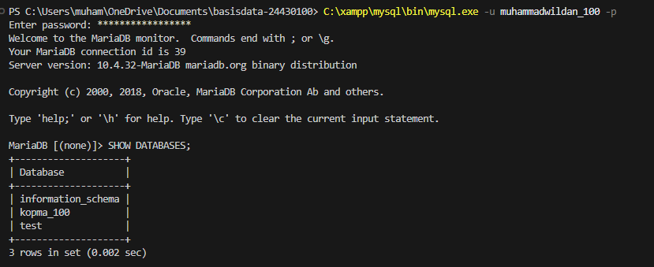
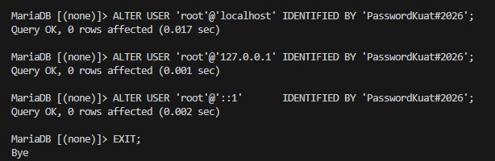
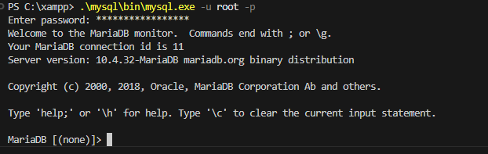
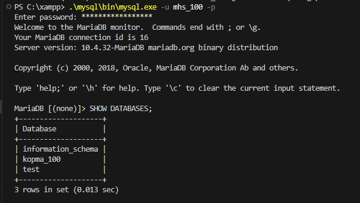
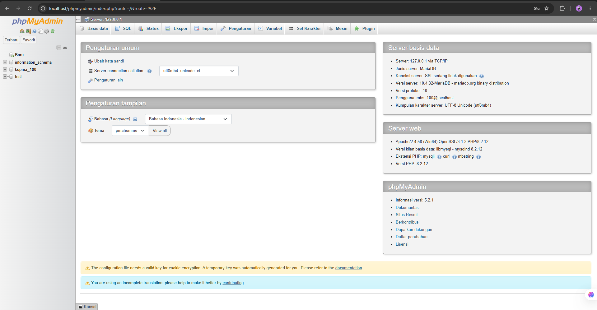
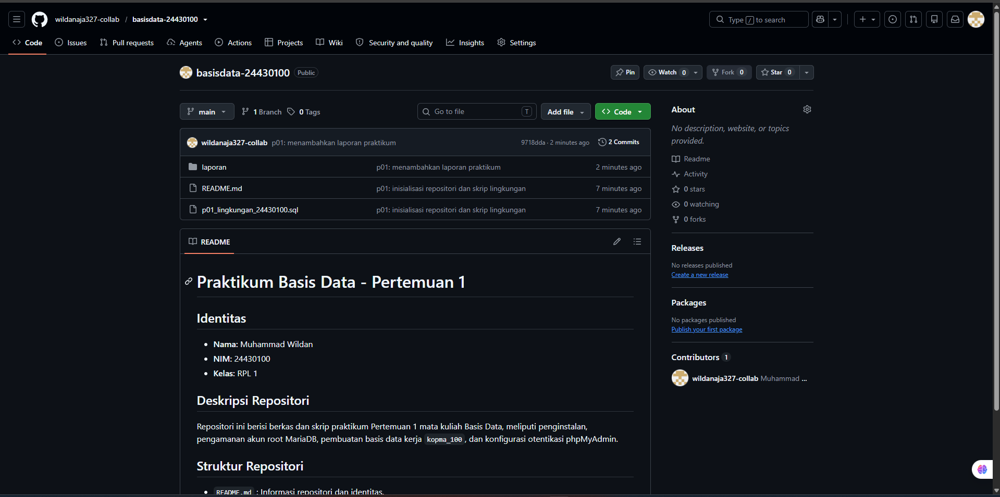
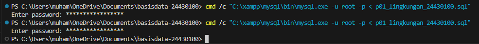

# Laporan Praktikum Basis Data - Pertemuan 01
**Nama:** Muhammad Wildan   **NIM:** 24430100   **Kelas:** RPL 1   **Tanggal:** 7 Oktober 2026

## 1. Tujuan Praktikum
- Menjalankan dan menghentikan service MariaDB menggunakan XAMPP Control Panel secara benar.
- Mengakses server MariaDB melalui antarmuka Command Line Interface (CLI) dan phpMyAdmin.
- Mengamankan akun utama (`root`) dengan memberikan password dan mengubah konfigurasi otentikasi phpMyAdmin ke mode `cookie`.
- Membuat basis data kerja (`kopma_100`) serta mengonfigurasi pengguna dengan hak akses penuh dan pembatasan hak akses (*least privilege*).
- Menginisialisasi repositori Git lokal dan mengunggah hasil laporan praktikum ke GitHub.

## 2. Ringkasan Dasar Teori
- **DBMS & MariaDB:** Database Management System (DBMS) adalah perangkat lunak yang bertugas mengelola penyimpanan, manipulasi, serta keamanan data secara terstruktur. MariaDB menggunakan arsitektur klien-server yang secara default berjalan pada port 3306.
- **Klien & Server SQL:** Aplikasi klien seperti Command Line Interface (`mysql.exe`) atau phpMyAdmin mengirimkan kueri SQL ke server daemon MariaDB (`mysqld.exe`) untuk diproses.
- **Prinsip Least Privilege:** Konsep keamanan basis data di mana setiap pengguna hanya diberikan hak akses (privilege) minimal yang diperlukan untuk menyelesaikan tugasnya, guna meminimalkan risiko kebocoran atau kerusakan data.
- **Pengamanan Otentikasi:** Mengubah metode otentikasi phpMyAdmin dari mode `config` menjadi `cookie` mewajibkan pengguna memasukkan kredensial login secara manual, sehingga mencegah akses tidak sah ke basis data.

## 3. Hasil Langkah Percobaan

### 3.1 Menjalankan Layanan MariaDB
1. Membuka **XAMPP Control Panel** dan menekan tombol **Start** pada modul **MySQL**.
2. Memastikan indikator modul MySQL berubah warna menjadi hijau dengan status port `3306` aktif.
3. Memeriksa panel log bagian bawah hingga muncul status `Status change detected: running` yang menandakan server MariaDB siap menerima koneksi.

### 3.2 Masuk Melalui Klien Baris Perintah & Verifikasi Server
1. Membuka Terminal / PowerShell di Antigravity dan masuk ke MariaDB sebagai pengguna `root` tanpa password:
   ```powershell
   .\mysql\bin\mysql.exe -u root
2. Memeriksa versi server MariaDB dan akun yang sedang aktif:
   ```sql
   SELECT VERSION(), CURRENT_USER();
   ```
3. Memeriksa mode SQL server untuk memastikan mode ketat (`STRICT_TRANS_TABLES`) aktif:
   ```sql
   SELECT @@sql_mode;
   ```
    
    *Keterangan: Hasil verifikasi menunjukkan MariaDB versi 10.4.32 berjalan sebagai `root@localhost` dengan mode SQL ketat.*

### 3.3 Mengamankan Akun root
1. Periksa akun root yang tersedia di server Anda:
   ```sql
   SELECT User, Host FROM mysql.user WHERE User = 'root';
   ```
   Pada XAMPP umumnya muncul tiga baris dengan host localhost, 127.0.0.1, dan ::1. Beri password yang sama pada setiap baris yang muncul. Ganti `PasswordKuat#2026` dengan password Anda sendiri, dan jangan menuliskannya di berkas yang akan di-commit.
   ```sql
   ALTER USER 'root'@'localhost' IDENTIFIED BY 'PasswordKuat#2026';
   ALTER USER 'root'@'127.0.0.1' IDENTIFIED BY 'PasswordKuat#2026';
   ALTER USER 'root'@'::1' IDENTIFIED BY 'PasswordKuat#2026';
   exit
   ```
   
2. Masuk kembali. Kali ini opsi `-p` wajib dipakai agar klien meminta password.
   ```powershell
   mysql -u root -p
   ```
   
    *Keterangan: Verifikasi login akun root dengan parameter -p dan password baru berhasil masuk ke prompt MariaDB.*

### 3.4 Membuat Basis Data dan Akun Kerja
1. Menggunakan akun `root` untuk membuat basis data kerja `kopma_100`, akun pengguna `muhammadwildan_100`, serta memberikan hak akses penuh hanya pada basis data tersebut:
   ```powershell
   .\mysql\bin\mysql.exe -u root -p
   ```
   Masukkan password `PasswordKuat#2026`, kemudian jalankan perintah SQL berikut:
   ```sql
   CREATE DATABASE IF NOT EXISTS kopma_100 CHARACTER SET utf8mb4 COLLATE utf8mb4_unicode_ci;
   CREATE USER IF NOT EXISTS 'muhammadwildan_100'@'localhost' IDENTIFIED BY 'PasswordKerja#100';
   GRANT ALL PRIVILEGES ON kopma_100.* TO 'muhammadwildan_100'@'localhost';
   SHOW GRANTS FOR 'muhammadwildan_100'@'localhost';
   EXIT;
   ```
2. Keluar dari akun `root`, lalu login menggunakan akun kerja `muhammadwildan_100` untuk memverifikasi batasan hak akses (*least privilege*):
   ```powershell
   .\mysql\bin\mysql.exe -u muhammadwildan_100 -p
   ```
   Masukkan password `PasswordKerja#100`, kemudian jalankan perintah berikut:
   ```sql
   SHOW DATABASES;
   USE mysql;
   EXIT;
   ```
   
    *Keterangan: Pengguna `muhammadwildan_100` hanya dapat melihat basis data `kopma_100` dan `information_schema`. Saat mencoba mengakses basis data `mysql`, sistem menolak akses dengan `ERROR 1044`, yang menunjukkan bahwa hak akses pengguna telah dibatasi sesuai prinsip least privilege.*

### 3.5 Menggunakan phpMyAdmin dengan Aman
1. Membuka berkas konfigurasi `phpMyAdmin/config.inc.php` dan mengubah skema otentikasi dari mode `config` menjadi `cookie`:

   ```php
   $cfg['Servers'][$i]['auth_type'] = 'cookie';
   ```
2. Mengakses halaman web phpMyAdmin di `http://localhost/phpmyadmin` dan melakukan login secara manual menggunakan akun kerja `muhammadwildan_100` dan password `PasswordKerja#100`.
3. Membuka tab **SQL** dan menjalankan kueri untuk memverifikasi versi server serta pengguna yang sedang aktif:
   ```sql
   SELECT VERSION(), CURRENT_USER();
   ```
   
*Keterangan: Hasil kueri pada tab SQL phpMyAdmin menunjukkan bahwa MariaDB versi 10.4.32 berjalan dengan pengguna aktif `muhammadwildan_100@localhost`.*

### 3.6 Menyiapkan Repositori Git
1. Membuat berkas skrip SQL `p01_lingkungan_100.sql` yang menyimpan seluruh perintah SQL untuk persiapan lingkungan kerja dengan mengganti nilai password menggunakan penanda `<password_kerja>`:
   ```sql
   -- p01_lingkungan_100.sql
   -- Password sengaja diganti penanda. JANGAN commit password asli.
   CREATE DATABASE IF NOT EXISTS kopma_100 CHARACTER SET utf8mb4 COLLATE utf8mb4_unicode_ci;
   CREATE USER IF NOT EXISTS 'muhammadwildan_100'@'localhost' IDENTIFIED BY '<password_kerja>';
   GRANT ALL PRIVILEGES ON kopma_100.* TO 'muhammadwildan_100'@'localhost';
   ```
2. Menginisialisasi repositori Git lokal, menambahkan seluruh berkas ke area *staging*, dan melakukan *commit* awal:
   ```powershell
   git init
   git add .
   git commit -m "p01: inisialisasi repositori dan skrip lingkungan"
   ```
3. Menghubungkan repositori lokal ke repositori remote GitHub dan mengunggah (*push*) ke cabang utama:
   ```powershell
   git remote add origin https://github.com/<akun_github>/basisdata-100.git
   git push -u origin main
   ```
   
*Keterangan: Proses inisialisasi repositori Git, penambahan berkas, commit, dan push ke repositori GitHub berhasil dilakukan.*

## 4. Jawaban Titik Analisis

### Titik Analisis 1: Perbedaan MySQL dan MariaDB pada XAMPP

**Konsekuensi Pencarian Solusi Galat di Internet:**
Meskipun XAMPP menampilkan label tombol bertuliskan "MySQL", mesin basis data (*database engine*) asli yang berjalan di latar belakang adalah **MariaDB** (sejak XAMPP beralih dari MySQL bawaan). Konsekuensinya saat mencari solusi galat (*error*) di internet:
1. **Sintaks atau Fitur Spesifik Berbeda:** Beberapa solusi galat MySQL 8.0+ yang ditemukan di internet mungkin menggunakan perintah, fungsi, atau mesin penyimpanan (*storage engine*) yang tidak didukung atau perilakunya berbeda pada MariaDB (misalnya sintaks *JSON*, *Window Functions*, atau sistem manajemen *user/plugin authentication* seperti `caching_sha2_password` vs `mysql_native_password`).
2. **Variabel Konfigurasi Berbeda:** Nama parameter atau direktori konfigurasi pada berkas `my.ini` / `my.cnf` antara MySQL dan MariaDB dapat memiliki perbedaan kata kunci.

**Kapan Dokumentasi MySQL Masih Relevan:**
Dokumentasi MySQL masih relevan digunakan apabila pertanyaan atau galat berkaitan dengan:
* **Perintah DDL/DML Dasar:** Perintah standar ANSI SQL seperti `CREATE DATABASE`, `CREATE TABLE`, `SELECT`, `INSERT`, `UPDATE`, `DELETE`, `JOIN`, dan *foreign key constraints*.
* **Otentikasi & Manajemen Pengguna Dasar:** Perintah dasar manajemen pengguna seperti `CREATE USER`, `GRANT ALL PRIVILEGES`, dan `FLUSH PRIVILEGES`.
* **Konektor & Driver Aplikasi:** Konfigurasi koneksi basis data standar melalui driver PHP (PDO/MySQLi), Python (MySQL Connector), atau aplikasi manajemen GUI seperti phpMyAdmin.

**Kapan Harus Merujuk ke Dokumentasi MariaDB:**
Dokumentasi MariaDB wajib dirujuk secara spesifik apabila menemukan kondisi:
* **Pengaturan Sistem Otentikasi & Plugin:** Masalah otentikasi akun `root` atau *user* baru yang melibatkan *plugin* internal MariaDB (seperti `unix_socket` atau `mysql_native_password`).
* **Fitur & Tipe Data Khusus MariaDB:** Penggunaan fitur spesifik yang dikembangkan oleh MariaDB, seperti *Storage Engine* khusus (Aria, ColumnStore), *Sequence*, atau penanganan tipe data *JSON* yang diimplementasikan secara berbeda dari MySQL.
* **Optimasi & Parameter Kinerja:** Pengaturan variabel performa basis data pada berkas konfigurasi `my.ini` serta penanganan pesan error internal MariaDB versi spesifik (misalnya MariaDB 10.4.x+).

### Titik Analisis 2: Analisis Pesan Galat ERROR 1045

**1. Pesan Galat yang Muncul:**
Saat mencoba masuk tanpa opsi `-p` menggunakan perintah `mysql -u root`, sistem menolak akses dan menampilkan pesan galat:
`ERROR 1045 (28000): Access denied for user 'root'@'localhost' (using password: NO)`

**2. Bagian Pesan yang Menunjukkan Klien Tidak Mengirim Password:**
Bagian frasa `(using password: NO)` pada akhir pesan galat menyatakan secara eksplisit bahwa klien CLI MySQL/MariaDB yang dijalankan tidak mengirimkan kata sandi (*password*) sama sekali saat mencoba melakukan otentikasi ke server.

**3. Perbandingan dengan Gambar 1.10 (Anatomi Pesan ERROR 1045):**
Hasil tangkapan layar pengujian identik dengan uraian pada Gambar 1.10:
* **ERROR 1045:** Kode galat spesifik MariaDB untuk kegagalan otentikasi/hak akses.
* **(28000):** Kode SQLSTATE yang menunjukkan kelas galat otorisasi (*authorization specification violation*).
* **'root'@'localhost':** Mengidentifikasi identitas akun (`pengguna@host`) yang mencoba melakukan koneksi.
* **(using password: NO):** Menjelaskan bahwa server menolak koneksi karena akun `root` telah dikonfigurasi menggunakan kata sandi, sementara klien mencoba masuk tanpa menyertakan opsi `-p` (tanpa kata sandi).

**Kesimpulan & Solusi:**
Perintah harus disesuaikan dengan menambahkan parameter `-p` (`mysql -u root -p`) agar sistem meminta input kata sandi sebelum membuka sesi MariaDB.

### Titik Analisis 3: Akses `information_schema` vs `mysql` dan Perbedaan Kode Galat 1044 & 1045

**1. Mengapa `information_schema` Tetap Terlihat oleh `muhammadwildan_100`:**
Skema `information_schema` adalah basis data sistem virtual (katalog data/kamus data) yang berisi metadata tentang seluruh objek basis data (seperti nama tabel, kolom, tipe data, dan hak akses). Setiap pengguna yang berhasil *login* ke MariaDB secara otomatis diberikan hak akses baca terbatas pada `information_schema`. Namun, pengguna hanya dapat melihat informasi/baris data terkait tabel dan skema yang *memang* diizinkan baginya (seperti skema `kopma_100`).

**2. Mengapa Akses ke Basis Data `mysql` Ditolak:**
Basis data `mysql` berisi tabel sistem fisik yang menyimpan informasi kredensial, hash kata sandi pengguna, serta aturan otorisasi global server. Karena pengguna `muhammadwildan_100` hanya diberikan hak akses (*privileges*) khusus pada skema `kopma_100` (`GRANT ALL PRIVILEGES ON kopma_100.*`), server MariaDB menolak perintah `USE mysql;` atau query ke basis data tersebut demi menjaga keamanan sistem.

**3. Perbedaan Kode Galat 1044 dan 1045:**

* **ERROR 1044 (42000): Access denied for user 'user'@'host' to database 'db_name'**
  * **Penyebab:** Terjadi saat proses **Otorisasi (Authorization)** gagal. Klien *berhasil login* ke server MariaDB (kredensial benar), tetapi pengguna tersebut *tidak memiliki hak akses/wewenang* untuk membuka atau mengoperasikan basis data tertentu (seperti basis data `mysql`).

* **ERROR 1045 (28000): Access denied for user 'user'@'host' (using password: YES/NO)**
  * **Penyebab:** Terjadi saat proses **Autentikasi (Authentication)** gagal di tahap awal masuk. Server menolak koneksi karena *kredensial salah* (misalnya nama pengguna tidak terdaftar, kata sandi salah, atau kata sandi tidak dikirimkan/tanpa opsi `-p`).

### Titik Analisis 4: Keamanan Mode `cookie` vs Mode `config` pada phpMyAdmin

**1. Risiko Keamanan Mode `config`:**
Pada mode `config`, kata sandi akun MariaDB disimpan dalam bentuk teks polos (*plaintext*) di dalam file konfigurasi `config.inc.php` di server. Hal ini menimbulkan beberapa celah keamanan kritis:
* **Akses Otomatis Tanpa Autentikasi:** Siapa pun yang membuka URL phpMyAdmin di peramban web (*browser*) akan langsung berhasil masuk sebagai pengguna tanpa perlu memasukkan kata sandi.
* **Kebocoran Berkas Konfigurasi:** Jika terdapat celah keamanan pada server web (*Local File Inclusion* atau salah konfigurasi hak akses file), pihak yang tidak berwenang dapat membaca file `config.inc.php` dan mencuri kata sandi `root` atau pengguna basis data.

**2. Keunggulan Keamanan Mode `cookie`:**
Mode `cookie` mewajibkan pengguna untuk melakukan proses autentikasi interaktif (mengetikkan *username* dan *password*) setiap kali sesi dimulai:
* **Kredensial Tidak Disimpan di Server:** Kata sandi tidak ditulis secara permanen dalam file konfigurasi server web.
* **Manajemen Sesi & Enkripsi Cookie:** Informasi otentikasi disimpan sementara di sisi klien (*browser*) dalam bentuk cookie yang terenkripsi (menggunakan string acak `blowfish_secret`).
* **Session Timeout Auto-Logout:** Sesi akan otomatis berakhir (*log out*) setelah waktu tenggang tertentu atau saat peramban ditutup, sehingga mencegah akses tidak sah jika komputer ditinggalkan dalam keadaan menyala.

## 5. Hasil Latihan dan Modifikasi

### 5.1 Latihan 1: Pembuatan Akun `tamu_100` dan Uji Hak Akses
1. Membuat akun `tamu_100` menggunakan akun `root` dan memberikan hak akses `SELECT` pada basis data `kopma_100`:
   ```sql
   CREATE USER 'tamu_100'@'localhost' IDENTIFIED BY 'PasswordTamu#100';
   GRANT SELECT ON kopma_100.* TO 'tamu_100'@'localhost';
   FLUSH PRIVILEGES;
   EXIT;
   ```
2. Masuk kembali ke MariaDB menggunakan akun `tamu_100`:
   ```powershell
   mysql -u tamu_100 -p
   ```
   Masukkan password `PasswordTamu#100`, kemudian pilih basis data `kopma_100` dan mencoba membuat tabel:
   ```sql
   USE kopma_100;
   CREATE TABLE uji (id INT);
   ```
   MariaDB menolak perintah tersebut dan menampilkan galat:
   ```text
   ERROR 1142 (42000): CREATE command denied to user 'tamu_100'@'localhost' for table 'uji'
   ```
3. Penjelasan kode galat:
    .png)
   - **Kode Galat:** `ERROR 1142 (42000)`
   - **Makna Galat:** Kode ini menunjukkan bahwa pengguna tidak memiliki hak akses yang diperlukan untuk menjalankan perintah tersebut. Pengguna `tamu_100` hanya diberikan hak `SELECT` pada basis data `kopma_100`, sehingga pengguna hanya dapat membaca data dan tidak memiliki hak `CREATE` untuk membuat tabel baru.

*Keterangan: Hasil pengujian menunjukkan bahwa penerapan hak akses terbatas (*least privilege*) berhasil. Akun `tamu_100` dapat diberikan akses baca melalui `SELECT`, tetapi tidak dapat melakukan perubahan struktur basis data seperti membuat tabel baru.*

### 5.2 Latihan 2: Modifikasi Skrip SQL Agar Idempotent

**1. Kode Skrip `p01_lingkungan_24430100.sql` Terbaru:**
    ```sql
    CREATE DATABASE IF NOT EXISTS kopma_100;

    CREATE USER IF NOT EXISTS 'muhammadwildan_100'@'localhost' IDENTIFIED BY 'PasswordKerja#100';
    GRANT ALL PRIVILEGES ON kopma_100.* TO 'muhammadwildan_100'@'localhost';

    CREATE USER IF NOT EXISTS 'tamu_100'@'localhost' IDENTIFIED BY 'PasswordTamu#100';
    GRANT SELECT ON kopma_100.* TO 'tamu_100'@'localhost';

    FLUSH PRIVILEGES;
    ```

**2. Hasil Pengujian Eksekusi Berulang:**
Skrip diuji dengan menjalankannya sebanyak dua kali melalui perintah shell berikut:
    ```powershell
    cmd /c "C:\xampp\mysql\bin\mysql.exe -u root -p < p01_lingkungan_24430100.sql"
    ```


- **Eksekusi Pertama:** Berhasil mengeksekusi seluruh instruksi pembuatan basis data dan pengguna.
- **Eksekusi Kedua:** Berhasil berjalan tanpa memicu pesan galat (*zero errors*). Klausa `IF NOT EXISTS` membuat MariaDB melewati pemrosesan instruksi `CREATE DATABASE` dan `CREATE USER` apabila objek tersebut sudah terdaftar di sistem.

*Keterangan: Pengujian menunjukkan bahwa skrip telah bersifat* idempotent, *sehingga dapat dijalankan berulang kali tanpa menyebabkan galat akibat basis data atau akun yang sebelumnya sudah dibuat.*

